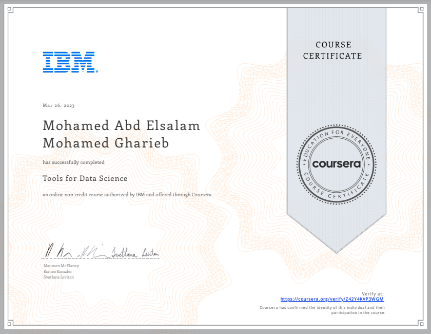

# 🧰 Tools for Data Science

## 📄 Course Overview
This is the **second course** in the IBM Data Science Professional Certificate. It introduces some of the most commonly used tools and environments in the field of data science. The course provides an overview of tools like **Jupyter Notebooks**, **RStudio**, **Watson Studio**, and others used for data analysis, model development, and deployment.

You’ll also gain hands-on experience through labs and understand the differences and uses of each environment in real-world scenarios.

---

## 🛠️ Tools Covered
- **Jupyter Notebooks**  
- **RStudio IDE**  
- **Watson Studio**  
- **Git and GitHub**  
- **Apache Zeppelin**  
- **IBM Cloud**  
- **Data Science Experience (DSX)**  
- **Visual Studio Code**

---

## 🔑 Key Skills Gained
- Understanding the ecosystem of tools in data science  
- Experience using cloud-based tools like IBM Watson Studio  
- Practice creating and running notebooks  
- Familiarity with version control using Git & GitHub  
- Knowing when and why to choose a specific tool

---

## 📂 Related Files in This Folder
- `Notes.md`: Summary of the most important topics and tools  
- `Lab-Jupyter_Notebooks.ipynb`: Hands-on lab work with Jupyter  
- `Tools_List.md`: My overview and comparison of the tools introduced  
- Any screenshots, images, or extra notebooks used in the course

---

## 🏆 Certificate of Completion

I completed this course as part of the IBM Data Science Professional Certificate.  
Click the certificate image below to view or verify it:

  

---

## 🌐 Connect with Me

- [LinkedIn](https://www.linkedin.com/in/mohamed-a-gharieb/)
- [Email](mailto:mo4u2030@gmail.com)

---

## 📌 Final Thoughts
This course helped me understand the landscape of tools used by data scientists daily. The hands-on labs gave me practical experience, especially with Jupyter and Watson Studio, which I now feel confident using in future projects.

---
