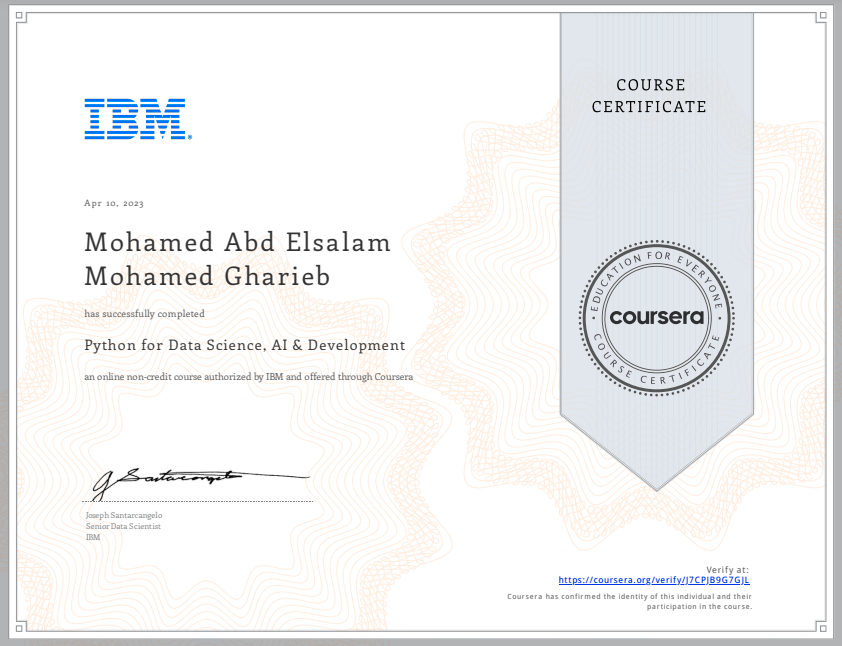

# 🐍 Python for Data Science, AI & Development

## 📄 Course Overview
This is the **fourth course** in the IBM Data Science Professional Certificate. It provides a comprehensive introduction to Python, one of the most popular and essential programming languages for data science, AI, and software development.

The course emphasizes hands-on programming experience and teaches the foundational skills needed to work with Python for real-world data science applications.

---

## 🧠 What You'll Learn

- Basics of Python syntax and programming concepts
- Working with data types (strings, lists, tuples, dictionaries)
- Writing functions, conditionals, and loops
- Using Python libraries such as:
  - **NumPy** (numerical operations)
  - **Pandas** (data manipulation)
- Reading and writing files
- Using Jupyter Notebooks for development

---

## 🔑 Key Skills Gained

- Python programming fundamentals  
- Data structures and logic in Python  
- Data manipulation with Pandas  
- Numerical computing with NumPy  
- Code structuring and documentation  
- Hands-on Jupyter Notebook usage

---

## 🏆 Certificate of Completion

I successfully completed this course as part of the IBM Data Science Professional Certificate.

  

---

## 🌐 Connect with Me

- [LinkedIn](https://www.linkedin.com/in/mohamed-a-gharieb/)
- [Email](mailto:mo4u2030@gmail.com)

---

## 💡 Final Thoughts

This course laid a solid foundation for programming in Python — a language that will be essential throughout the rest of the specialization. With hands-on labs in Jupyter Notebooks, I learned how to think like a programmer and write clean, functional Python code for data science tasks.

---

