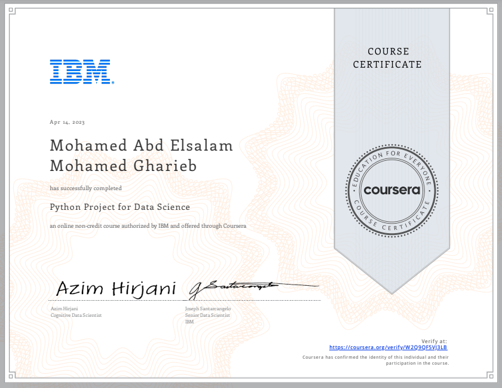

# 🚀 Python Project for Data Science

This is the fifth course in the [IBM Data Science Professional Certificate](https://www.coursera.org/professional-certificates/ibm-data-science), and it marks a practical turning point — applying Python, Pandas, data visualization, and web scraping skills to a real-world dataset.

## 📌 Course Overview

In this course, I built a data science project from end to end using Python. The project is based on SpaceX Falcon 9 launch records. I used various tools and libraries to gather, process, analyze, and visualize the data, and then developed a simple machine learning model to predict launch success.

## 💻 Tools & Libraries Used

- Python
- Jupyter Notebook
- Pandas
- Numpy
- Plotly
- BeautifulSoup (for web scraping)
- Folium
- Scikit-learn

## 📊 Project Objectives

- Web scraping SpaceX data from a Wikipedia page
- Cleaning and preprocessing the data
- Creating informative visualizations
- Performing exploratory data analysis (EDA)
- Applying logistic regression to predict launch outcomes
- Evaluating model performance

## 📁 Project Files

- `Project_Notebook.ipynb` – The complete Jupyter notebook with all code, outputs, and visualizations
- `Dataset/` – Contains any external or downloaded CSVs
- `Notes.md` – Personal insights, breakdowns, and observations during the project
- `Certificate.png` – Verified certificate of course completion

## 📜 Certificate

  

---

## 🌐 Connect with Me

- [LinkedIn](https://www.linkedin.com/in/mohamed-a-gharieb/)
- 📧 [mo4u2030@gmail.com](mailto:mo4u2030@gmail.com)

---

> “Practice beats theory every time.” — This course helped me strengthen my hands-on data science skills using Python.

