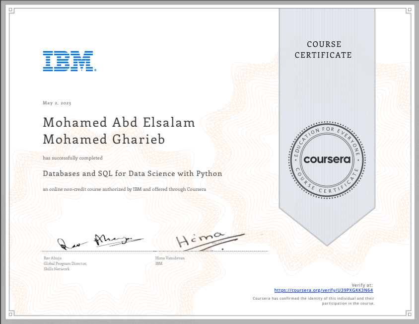

# 🗄️ Databases and SQL for Data Science

This is the sixth course in the [IBM Data Science Professional Certificate](https://www.coursera.org/professional-certificates/ibm-data-science). In this course, I learned how to work with SQL and relational databases, a critical skill in accessing and manipulating structured data for analysis.

---

## 📚 Course Summary

The course introduces the basics of relational databases and focuses on how to use **SQL** to query data. It covers foundational commands, how to filter, sort, join tables, use subqueries, create views, and work with real-world datasets using **Jupyter Notebooks**.

---

## 💡 Key Topics Covered

- Understanding relational databases and tables
- Basic SQL syntax: `SELECT`, `WHERE`, `ORDER BY`, `LIMIT`
- Using logical operators: `AND`, `OR`, `IN`, `BETWEEN`
- Aggregate functions: `COUNT()`, `SUM()`, `AVG()`, `MAX()`, `MIN()`
- Table joins: `INNER JOIN`, `LEFT JOIN`, `RIGHT JOIN`
- Creating and modifying tables using `CREATE`, `INSERT`, `UPDATE`, `DELETE`
- Subqueries, aliases, and views
- Hands-on SQL querying in Jupyter with **SQL magic (%sql)**

---

## 🛠️ Tools & Technologies Used

- **SQL** (Structured Query Language)
- **Jupyter Notebook** (via IBM Watson Studio)
- **Db2 Database** (IBM Cloud)
- `%sql` magic command in Jupyter
- Python integration with SQL

---

## 🧠 Skills Gained

- Writing SQL queries to select, filter, and aggregate data
- Joining multiple tables and performing set operations
- Using subqueries and views to simplify complex queries
- Working with SQL inside Jupyter notebooks
- Understanding database schema and design basics

---

## 📜 Certificate

<p align="center">
  <a href="https://coursera.org/share/YOUR_CERTIFICATE_LINK_HERE">
    
  </a>
</p>

---

## 🗂️ Repository Contents

```bash
06_Databases_and_SQL_for_Data_Science/
├── README.md               # This file
├── Notes.md                # Course notes and syntax summaries
├── SQL_Examples.sql        # Sample SQL queries
├── Project_Notebook.ipynb  # Final project or practice notebook
└── Certificate.png         # Course completion certificate
