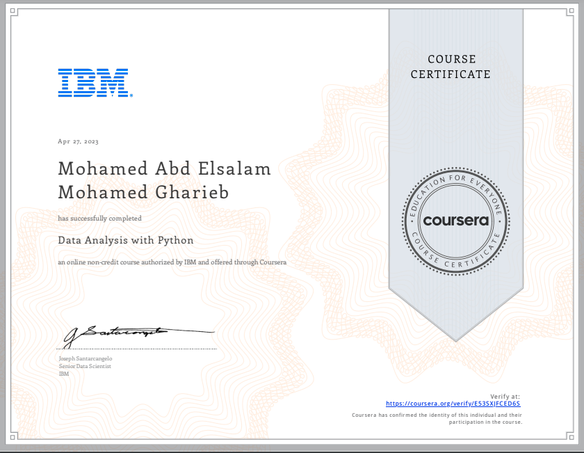

# 📊 Data Analysis with Python

This course covers the process of analyzing data using Python — from data wrangling to exploratory analysis, statistical techniques, and basic machine learning models for prediction.

---

## 🎯 Course Overview

In this course, we learn how to:
- Import, clean, and manipulate data using **Pandas** and **NumPy**.
- Perform **Exploratory Data Analysis (EDA)** to uncover patterns and trends.
- Apply **statistical analysis** and hypothesis testing.
- Build and evaluate **regression models** for prediction.
- Visualize data with **Matplotlib** and **Seaborn**.

---

## 🛠️ Tools and Libraries

- **Python**
- **Pandas** (data manipulation)
- **NumPy** (numerical computing)
- **Matplotlib** & **Seaborn** (data visualization)
- **Scikit-learn** (machine learning)
- **Jupyter Notebook**

---

## 📌 Main Topics Covered

1. **Data Wrangling** – loading, cleaning, and transforming datasets.
2. **Exploratory Data Analysis (EDA)** – descriptive statistics and visual exploration.
3. **Model Development** – building regression models.
4. **Model Evaluation & Refinement** – improving accuracy and performance.
5. **Practical Applications** – working on real datasets.

---

## 📂 Repository Structure

```

08\_Data\_Analysis\_with\_Python/
├── README.md
├── Notes.md
├── Projects/
│   ├── data\_wrangling.ipynb
│   ├── exploratory\_data\_analysis.ipynb
│   ├── statistical\_analysis.ipynb
│   └── final\_project.ipynb
├── datasets/
│   └── \[datasets used]
├── Certificate.png

```

---

## 📜 Certificate



[🔗 View Verified Certificate](https://coursera.org/share/YOUR_CERTIFICATE_LINK)

---

## 🌐 Connect with Me

- [LinkedIn](https://www.linkedin.com/in/mohamed-a-gharieb/)
- 📧 [Email](mailto:mo4u2030@gmail.com)

---
تحب أبدأ في **Notes.md** دلوقتي؟

