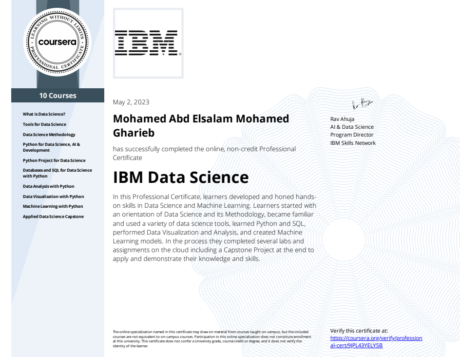

# Machine Learning with Python

Part of the **IBM Data Science Professional Certificate** offered on Coursera.

## 📚 Course Overview
This course introduces the fundamentals of Machine Learning using Python.  
Learners explore supervised and unsupervised learning techniques, build predictive models, and evaluate their performance using real-world datasets.

**Instructor:** Rav Ahuja & Saeed Aghabozorgi  
**Platform:** [Coursera](https://www.coursera.org/learn/machine-learning-with-python)  
**Completion Date:** May 2, 2023

---

## 🛠 Skills Learned
- Understanding the basics of Machine Learning and its applications
- Implementing supervised learning algorithms (Linear Regression, Decision Trees, KNN, Logistic Regression)
- Implementing unsupervised learning algorithms (K-Means, Hierarchical Clustering)
- Building and evaluating predictive models
- Using Python libraries like Scikit-learn, Pandas, Matplotlib, and Seaborn

---

## 📂 Course Contents
1. Introduction to Machine Learning
2. Regression
3. Classification
4. Clustering
5. Recommender Systems
6. Final Project

---

## 📜 Certificate
  
🔗 [Verify Certificate](https://www.coursera.org/account/accomplishments/specialization/certificate/9JPL43YELY5B)

