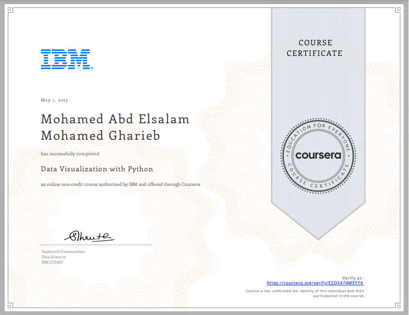

# 📊 Data Visualization with Python

## 📄 Summary  
This course explores the fundamentals and advanced techniques of **data visualization** using Python.  
It covers how to create meaningful and impactful charts, graphs, and dashboards that communicate insights effectively.  
We use libraries such as **Matplotlib**, **Seaborn**, **Plotly**, and **Dash** to present data visually and interactively.

Data visualization is a key skill for data scientists, enabling them to transform raw data into clear and actionable insights.

---

## 📑 Main Topics  

- Introduction to Data Visualization Tools (Matplotlib, Seaborn)
- Basic and Specialized Visualization Tools (bar, pie, box, scatter, bubble)
- Advanced Visualizations and Geospatial Data (Folium maps, Choropleth)
- Creating Dashboards with Plotly and Dash
- Final Project & Exam

---

## 🔑 Key Skills Learned  

- Building different types of plots and charts using **Matplotlib** and **Seaborn**
- Creating interactive dashboards using **Plotly** and **Dash**
- Visualizing geospatial data with **Folium**
- Designing impactful and storytelling visualizations
- Integrating multiple visualizations into one dashboard

---

## 🏆 Certificate  

  
[🔗 View Verified Certificate](https://coursera.org/share/523a0aceca070b99931dc9431cb31705)

---

## 🌐 Connect with Me  

- [LinkedIn](https://www.linkedin.com/in/mohamed-a-gharieb/)  
- 📧 [Email](mailto:mo4u2030@gmail.com)

---
