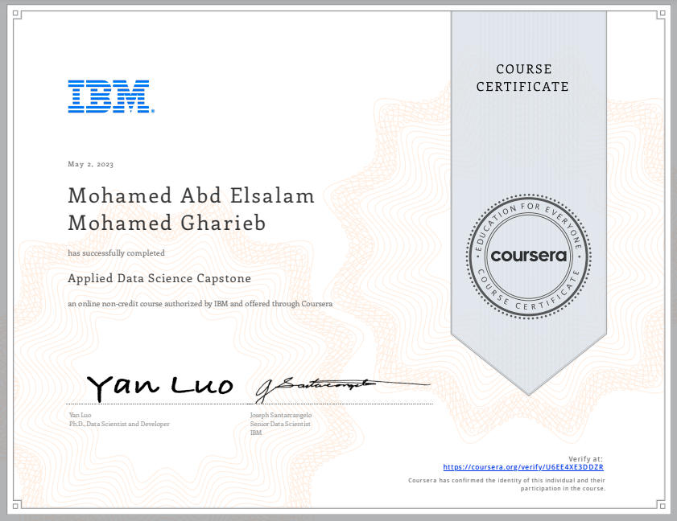

# 🏆 Applied Data Science Capstone

This is the final course in the **IBM Data Science Professional Certificate**.  
In this Capstone, all the skills and tools learned throughout the program are applied to solve a **real-world problem** using data.

---

## 🎯 Course Overview

The Capstone project simulates a real-life data science scenario — from problem definition to deploying insights.  
You'll work through the **Data Science Methodology** to collect, clean, analyze, model, and visualize data to address a specific business or societal challenge.

> **Project Title**: *[Add your project title here]*  
> **Problem Statement**: *[Describe the problem you are trying to solve]*  
> **Dataset**: *[Brief description of dataset — e.g., API data, Kaggle datasets]*  

---

## 🛠️ Tools and Technologies

- **Python** (Pandas, NumPy, Scikit-learn)
- **SQL** (data extraction and querying)
- **Matplotlib / Seaborn** (visualization)
- **Folium** (geospatial visualization)
- **Foursquare API** / Web scraping
- **IBM Watson Studio** (collaboration and deployment)

---

## 📌 Project Steps

1. **Problem Definition**  
   Define the business or societal problem and desired outcome.

2. **Data Collection**  
   Collect relevant datasets from APIs, web scraping, or open data repositories.

3. **Data Wrangling**  
   Clean and prepare data for analysis.

4. **Exploratory Data Analysis (EDA)**  
   Discover trends, patterns, and correlations.

5. **Modeling**  
   Apply machine learning algorithms to address the problem.

6. **Visualization & Storytelling**  
   Communicate results through clear visualizations and a compelling narrative.

---

---

## 📜 Certificate

  

[🔗 View Verified Certificate](https://www.coursera.org/account/accomplishments/certificate/YOUR_CERTIFICATE_ID)

---

## 🌐 Connect with Me

- [LinkedIn](https://www.linkedin.com/in/mohamed-a-gharieb/)
- 📧 [Email](mailto:mo4u2030@gmail.com)

---

> 🚀 This Capstone represents the integration of all concepts learned in the IBM Data Science Professional Certificate into a single, comprehensive project.

