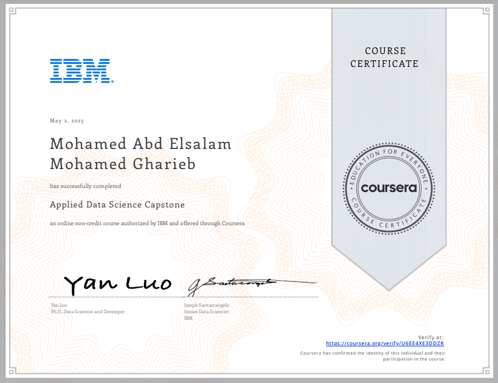

# 🧠 IBM Data Science Capstone Project

Welcome to the final course of the IBM Data Science Professional Certificate!  
This Capstone project puts together all the skills and tools acquired throughout the program and applies them to solve a real-world problem using data.

---

## 🎯 Project Overview

The Capstone Project focuses on demonstrating the data science methodology in practice. The goal is to define a problem, acquire and analyze data, build a model, and derive actionable insights.

> 🧩 **Project Title**: *Segmenting and Clustering Neighborhoods in a City*  
> 📍 **Problem Statement**: How can we use geolocation data and clustering algorithms to help businesses decide the best location to open a new venue?  
> 📂 **Dataset**: Data retrieved using the Foursquare API along with public data about neighborhoods in a city.

---

## 🛠️ Tools and Technologies Used

- Python (Pandas, NumPy, Scikit-learn)
- Jupyter Notebook
- IBM Watson Studio
- Matplotlib / Seaborn (for visualization)
- Foursquare API (for geolocation-based data)
- Folium (for interactive maps)
- SQL (for data querying)

---

## 🔍 Project Steps

1. **Data Collection**  
   Collected neighborhood data using public sources and enriched it with Foursquare location data.

2. **Exploratory Data Analysis (EDA)**  
   Identified common venues and patterns across neighborhoods.

3. **Data Modeling**  
   Used K-Means clustering to segment neighborhoods into similar groups.

4. **Visualization**  
   Displayed clustered neighborhoods using Folium interactive maps.

5. **Conclusion & Recommendations**  
   Provided insights into which areas are most suitable for different business types based on neighborhood characteristics.

---

## 🧾 Deliverables

- 📓 Capstone Notebook: `Capstone_Notebook.ipynb`
- 📊 Visuals and charts (see `/visuals`)
- 📁 Dataset (see `/dataset`)
- 🏆 Certificate of Completion

---

## 📜 Certificate

[🔗 View Verified Certificate](https://coursera.org/share/9b4de008db0f2878d16544ad71bc671c)

---

## 🌐 Connect with Me

- [LinkedIn](https://www.linkedin.com/in/mohamed-a-gharieb/)
- 📧 [Email](mailto:mo4u2030@gmail.com)

---

> 🚀 This Capstone project is a culmination of 10 courses in data science, preparing me for real-world data-driven challenges.
